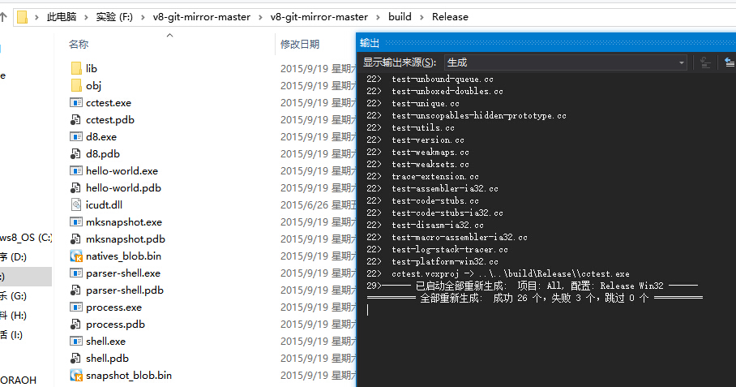

# Javascript-LocalCompiler

How to bulid a local compiler about Javascript?

I will use [V8](https://developers.google.com/v8/), which is a javascript engine from Google.
And the local compiler can work on the Windows.

# Getting the code of V8

[V8 Git repository](https://chromium.googlesource.com/v8/v8.git)

If you can't open or download it, you also can use the mirror which is on the Github

[GitHub mirror](https://github.com/v8/v8-git-mirror)

# How to bulid

First, you should install python environment on your computer, I suggest installing python2.7

then, you should generate project files

        python build\gyp_v8

if gyp tell you \third_party\icu\icu.gyp not found, you should install some third-party modules( you should install [svn tool](http://tortoisesvn.net/downloads.html) )

        svn co http://src.chromium.org/svn/trunk/deps/third_party/cygwin third_party/cygwin
        svn co https://src.chromium.org/chrome/trunk/deps/third_party/icu46 third_party/icu

if project files generate successfully, you will get all.sln and open it by VS2013

then, start building solution

Now, you can use d8.exe or shell.exe to run your javascript code, and it is similar with the console of many browsers, especially Chrome, which is based on the V8. There are some subtle differences between them. For example, you can't use the method of **console.log()** to print output the result of your code

# How to get the data from stdin

Readline support for the d8 shell, and you must add the optional parameter when you generate project files

        python build\gyp_v8 -Dconsole=readline

then, you should import some documents to the project

        #include <readline/readline.h>
        #include <readline/history.h>

# How to get and install the compiler directly

You need three documents: d8.exe, history5.dll and readline5.dll

Put **history5.dll** and **readline5.dll** into 

        C:\Windows\System32
        C:\Windows\SysWOW64

# How to use the compiler

You can look up [demo.js](demo.js)

# Help

If you want to compile it by yourself but you are in trouble, you can send mail to me, and I will help you as far as possible

If you can't get the third-party modules of cygwin and icu, you can contact me and I will send them from my local to you. However, I can't guarantee the module is newest.
